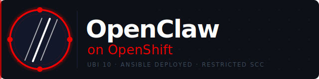

<div align="center">
  

  <br/><br/>

  [](https://github.com/ryannix123/openclaw-on-openshift/actions/workflows/build.yml)
  [](https://catalog.redhat.com/software/containers/ubi10/nodejs-22)
  [](https://developers.redhat.com/developer-sandbox)
  [](https://docs.ansible.com/)
  [](https://nodejs.org/)
  [](https://quay.io/repository/ryan_nix/openclaw-openshift)
  [](https://docs.openshift.com/container-platform/4.17/authentication/managing-security-context-constraints.html)

  <br/>

  *[OpenClaw](https://github.com/openclaw/openclaw) on Red Hat UBI 10 — deployed to OpenShift with a single Ansible command.*

</div>

---

## Prerequisites

```bash
pip install ansible kubernetes
ansible-galaxy collection install kubernetes.core
oc login --token=<token> --server=https://api.sandbox-xyz.openshiftapps.com:6443
```

You'll also need a [Quay.io](https://quay.io) account and an API key from your AI provider of choice.

---

## Quick Start

```bash
# Deploy
ansible-playbook openclaw-on-ocp.yml \
  -e ai_provider=anthropic \
  -e ai_api_key=sk-ant-...

# Delete (preserves PVC data)
ansible-playbook openclaw-on-ocp.yml -e state=absent

# Delete everything including data
ansible-playbook openclaw-on-ocp.yml -e state=absent -e delete_pvcs=true
```

The playbook auto-detects your active `oc` project — no namespace config needed.

---

## AI Providers

Set `ai_provider` to any of the following. The matching API key env var is injected automatically. Leave `ai_model` empty to use the provider default.

| Provider | Default model |
|---|---|
| `anthropic` | `anthropic/claude-sonnet-4-6` |
| `openai` | `openai/gpt-5.5` |
| `google` | `google/gemini-2.5-pro` |
| `xai` | `xai/grok-3` |
| `mistral` | `mistral/mistral-large-latest` |
| `cohere` | `cohere/command-r-plus` |

Switch provider without rebuilding the image:

```bash
ansible-playbook openclaw-on-ocp.yml \
  -e ai_provider=openai \
  -e ai_api_key=sk-proj-...
```

Switch model live from the Control UI chat: `/model anthropic/claude-opus-4-6`

---

## Accessing the Control UI

The playbook prints your URL and token at the end of every run. Retrieve them anytime:

```bash
# Route URL
oc get route openclaw -o jsonpath='https://{.spec.host}{"\n"}'

# Gateway token
oc get secret openclaw-credentials \
  -o jsonpath='{.data.OPENCLAW_GATEWAY_TOKEN}' | base64 -d && echo
```

Open the URL, paste the token, and click **Connect**. On first connect from a new browser, approve the device pairing request shown on screen:

```bash
oc exec deploy/openclaw -- node dist/index.js devices approve <requestId>
```

One-time per browser — future logins go straight through.

---

## Messaging Channels

Configure headless-compatible channels in `vars/openclaw.yml` with `enabled: true`. Tokens are stored in an OpenShift Secret — never in ConfigMaps or the image.

| Channel | Notes |
|---|---|
| Telegram ✅ | Bot token from @BotFather |
| Discord ✅ | Bot token from developer portal |
| Slack ✅ | Three tokens (bot, app, signing secret) |
| WhatsApp Business ✅ | Meta developer account + public webhook |
| Matrix ✅ | Access token from any homeserver |
| Teams ✅ | Azure bot registration |
| WhatsApp (Baileys) ❌ | Requires phone QR scan — not headless |
| iMessage / Signal ❌ | Require companion app or interactive setup |

---

## Custom Skills

Skills are `SKILL.md` files with YAML frontmatter that teach the agent new capabilities. Add them to `vars/openclaw.yml`:

```yaml
openclaw_custom_skills:
  - name: my-skill
    skill_md: "{{ lookup('file', 'skills/my-skill/SKILL.md') }}"
```

See `skills/satellite-cv-promote/SKILL.md` for a working example.

---

## CI/CD

GitHub Actions builds and pushes to [Quay.io](https://quay.io/repository/ryan_nix/openclaw-openshift) nightly. A version check against the upstream OpenClaw release skips the build if nothing changed.

**Required secrets:** `QUAY_USERNAME` (`ryan_nix+github_actions_openclaw`) and `QUAY_PASSWORD` (robot account token).

| Tag | When |
|---|---|
| `:latest` | Every push to `main` + nightly |
| `:YYYY.MM.DD` | Every build |
| `:git-<sha>` | Every build — immutable |
| `:openclaw-<version>` | Tracks upstream release |

---

## Route Security

The Control UI is gated by the gateway token. For public deployments, restrict access further:

```bash
# IP allowlist via HAProxy annotation
oc annotate route openclaw \
  haproxy.router.openshift.io/ip_whitelist="203.0.113.10/32" \
  --overwrite

# Rotate the gateway token
NEW_TOKEN=$(openssl rand -hex 32)
oc patch secret openclaw-credentials --type='json' \
  -p="[{\"op\":\"replace\",\"path\":\"/data/OPENCLAW_GATEWAY_TOKEN\",\"value\":\"$(echo -n $NEW_TOKEN | base64)\"}]"
oc rollout restart deployment/openclaw
```

See [ARCHITECTURE.md](ARCHITECTURE.md) for full security details and NetworkPolicy examples.

---

## Further Reading

- [ARCHITECTURE.md](ARCHITECTURE.md) — storage layout, SCC design, security hardening
- [OpenClaw docs](https://docs.openclaw.ai)
- [OpenClaw releases](https://github.com/openclaw/openclaw/releases)

---

<div align="center">
  <sub>Built on Red Hat UBI 10 · Deployed with Ansible · Running on OpenShift 🦞</sub>
</div>