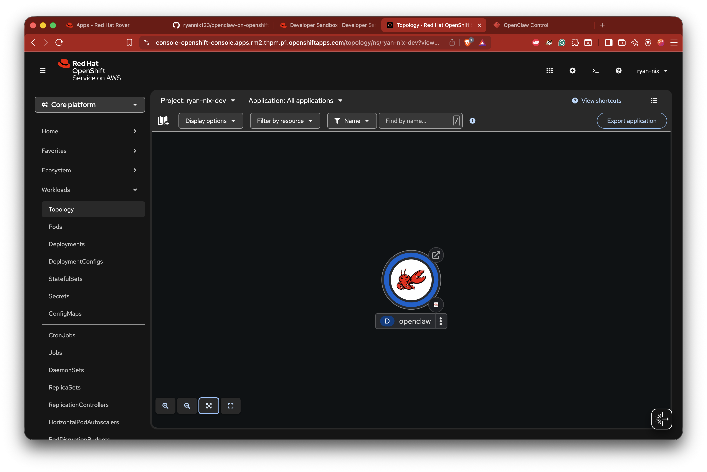
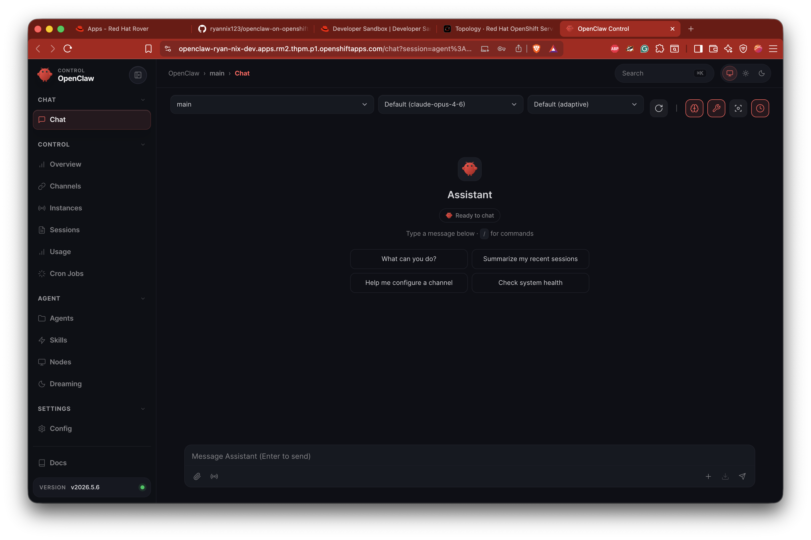

<div align="center">
  

  <br/><br/>

  [](https://github.com/ryannix123/openclaw-on-openshift/actions/workflows/build.yml)
  [](https://catalog.redhat.com/software/containers/ubi10/nodejs-24)
  [](https://hummingbird-project.io)
  [](https://developers.redhat.com/developer-sandbox)
  [](https://docs.ansible.com/)
  [](https://nodejs.org/)
  [](https://quay.io/repository/ryan_nix/openclaw-openshift)
  [](https://docs.openshift.com/container-platform/4.17/authentication/managing-security-context-constraints.html)

  <br/>

  *[OpenClaw](https://github.com/openclaw/openclaw) on **Red Hat UBI 10** or **Project Hummingbird** — deployed to OpenShift with a single Ansible command.*

</div>

---

## Why this exists

[OpenClaw](https://github.com/openclaw/openclaw) is the fastest-growing software project in GitHub history — 366,000 stars in under five months. It connects AI models to the tools, files, and platforms you already use. It's powerful, it's fast-moving, and 93% of publicly exposed instances have authentication bypass vulnerabilities.

Running OpenClaw on your laptop is easy. Running it **safely, in production** is a different problem entirely.

This project solves that. OpenClaw packaged as a Red Hat container, deployed to OpenShift via Ansible — with enterprise-grade security baked in from the first command:

- **Your choice of base image.** Red Hat UBI 10 (familiar, full toolchain) or Project Hummingbird (distroless, near-zero CVEs, signed SBOM) — switch with one variable
- **Secrets stay secret.** API keys and tokens live in OpenShift Secrets, injected as env vars at runtime — never in the image or ConfigMaps
- **Zero data loss on upgrade.** PVC-backed config and workspace survive pod restarts, image rebuilds, and redeployments
- **One command to deploy, one to delete.** Ansible handles everything — Secrets, PVCs, Route, device pairing, model config — start to finish
- **Always current.** Nightly CI/CD builds both variants, tracks upstream OpenClaw releases, and rebuilds only when something changes

If you run OpenShift and you want OpenClaw, this is how you do it right.

---

## 🆓 Red Hat Developer Sandbox

The [Red Hat Developer Sandbox](https://developers.redhat.com/developer-sandbox) is a **free** OpenShift environment — no credit card required.

- **Free tier** — Instant access, no cost
- **Generous resources** — 14 GB RAM, 40 GB storage, 3 CPU cores
- **Latest OpenShift** — Always running a recent version
- **Pre-configured** — Routes, TLS, and image registry included out of the box

### Waking Up After Hibernation

The Sandbox scales pods to zero after 12 hours of inactivity. Your PVC data is safe — just bring the pod back up:

```bash
oc scale deployment openclaw --replicas=1
```

### See it in action

<div align="center">
  
  &nbsp;
  

  <br/><br/>

  <a href="https://youtu.be/IDiXK8MYUBo">
    
  </a>

  *▶️ Watch the full walkthrough on YouTube*
</div>

---

## Prerequisites

### OpenShift CLI

```bash
# macOS
brew install openshift-cli

# Linux (download directly)
curl -LO https://mirror.openshift.com/pub/openshift-v4/clients/ocp/latest/openshift-client-linux.tar.gz
tar xf openshift-client-linux.tar.gz && sudo mv oc /usr/local/bin/

# Verify
oc version
```

Log in via the Sandbox console: **your username → Copy login command → paste it in your terminal.**

### Ansible + Kubernetes

```bash
pip install ansible kubernetes
ansible-galaxy collection install kubernetes.core
```

You'll also need a [Quay.io](https://quay.io) account and an API key from your AI provider of choice.

---

## Container Images

Two variants are available on [Quay.io](https://quay.io/repository/ryan_nix/openclaw-openshift) — choose based on your security requirements:

| Variant | Base image | Tag | Entrypoint | Best for |
|---|---|---|---|---|
| **UBI 10** *(default)* | `ubi10/nodejs-24` | `:latest` | `entrypoint.sh` | Familiar tooling, full Red Hat ecosystem |
| **Hummingbird** | `hi/nodejs:24` (distroless) | `:hummingbird-latest` | `entrypoint.js` | Near-zero CVEs, Node 24 runtime, regulated industries |

Both are built and pushed nightly by GitHub Actions. Both support all AI providers, channels, and custom skills.

---

## Quick Start

```bash
# Deploy with UBI 10 (default)
ansible-playbook openclaw-on-ocp.yml \
  -e ai_provider=anthropic \
  -e ai_api_key=sk-ant-...

# Deploy with Project Hummingbird (near-zero CVE, distroless)
ansible-playbook openclaw-on-ocp.yml \
  -e ai_provider=anthropic \
  -e ai_api_key=sk-ant-... \
  -e openclaw_variant=hummingbird

# Delete (preserves PVC data)
ansible-playbook openclaw-on-ocp.yml -e state=absent

# Delete everything including data
ansible-playbook openclaw-on-ocp.yml -e state=absent -e delete_pvcs=true
```

The playbook auto-detects your active `oc` project — no namespace config needed.

---

## AI Providers

Set `ai_provider` to any of the following. The matching API key env var is injected automatically. Leave `ai_model` empty to use the provider default.

| Provider | Default model |
|---|---|
| `anthropic` | `anthropic/claude-sonnet-4-6` |
| `openai` | `openai/gpt-5.5` |
| `google` | `google/gemini-2.5-pro` |
| `xai` | `xai/grok-3` |
| `mistral` | `mistral/mistral-large-latest` |
| `cohere` | `cohere/command-r-plus` |

Switch provider without rebuilding the image:

```bash
ansible-playbook openclaw-on-ocp.yml \
  -e ai_provider=openai \
  -e ai_api_key=sk-proj-...
```

Switch model live from the Control UI chat: `/model anthropic/claude-opus-4-6`

---

## Accessing the Control UI

The playbook prints your URL and token at the end of every run. Retrieve them anytime:

```bash
# Route URL
oc get route openclaw -o jsonpath='https://{.spec.host}{"\n"}'

# Gateway token
oc get secret openclaw-credentials \
  -o jsonpath='{.data.OPENCLAW_GATEWAY_TOKEN}' | base64 -d && echo
```

Open the URL, paste the token, and click **Connect**.

On first connect from a new browser, OpenClaw requires device pairing approval. The playbook handles this automatically:

1. Waits for the pod to be fully Ready
2. Prints the direct URL and pauses — you'll see something like:

```
TASK [Prompt user to open browser and connect] *******
OpenClaw is ready. Open the Control UI and click Connect:
https://<route>/?token=<token>

Just press ENTER after clicking Connect — do not type anything.
```

3. Open the URL, click **Connect**, then press **Enter** in the terminal
4. The playbook detects and approves the pending pairing request automatically
5. Click **Connect** once more in the browser — you're in

> **Note:** When Ansible's `pause:` prompt is waiting, just press Enter — don't type the requestId shown in the browser. The playbook retrieves and approves it automatically.

**Already paired?** Skip the pairing step on subsequent deploys:

```bash
ansible-playbook openclaw-on-ocp.yml \
  -e ai_provider=anthropic \
  -e ai_api_key=sk-ant-... \
  -e skip_pairing=true
```

**Manual approval** (if the playbook's pairing request expires):

```bash
# Trigger a fresh request by clicking Connect in the browser, then:
oc exec deploy/openclaw -- node dist/index.js devices approve <requestId>

# List pending requests
oc exec deploy/openclaw -- node dist/index.js devices list
```

Pairing is stored on the config PVC — one-time per browser, survives pod restarts.

---

## Messaging Channels

Configure headless-compatible channels in `vars/openclaw.yml` with `enabled: true`. Tokens are stored in an OpenShift Secret — never in ConfigMaps or the image.

| Channel | Notes |
|---|---|
| Telegram ✅ | Bot token from @BotFather |
| Discord ✅ | Bot token from developer portal |
| Slack ✅ | Three tokens (bot, app, signing secret) |
| WhatsApp Business ✅ | Meta developer account + public webhook |
| Matrix ✅ | Access token from any homeserver |
| Teams ✅ | Azure bot registration |
| WhatsApp (Baileys) ❌ | Requires phone QR scan — not headless |
| iMessage / Signal ❌ | Require companion app or interactive setup |

---

## Custom Skills

Skills are `SKILL.md` files with YAML frontmatter that teach the agent new capabilities. Add them to `vars/openclaw.yml`:

```yaml
openclaw_custom_skills:
  - name: my-skill
    skill_md: "{{ lookup('file', 'skills/my-skill/SKILL.md') }}"
```

See `skills/satellite-cv-promote/SKILL.md` for a working example.

---

## CI/CD

GitHub Actions builds and pushes to [Quay.io](https://quay.io/repository/ryan_nix/openclaw-openshift) nightly. A version check against the upstream OpenClaw release skips the build if nothing changed.

**Required secrets:** `QUAY_USERNAME` (`ryan_nix+github_actions_openclaw`) and `QUAY_PASSWORD` (robot account token).

| Tag | When |
|---|---|
| `:latest` | Every push to `main` + nightly |
| `:YYYY.MM.DD` | Every build |
| `:git-<sha>` | Every build — immutable |
| `:openclaw-<version>` | Tracks upstream release |

---

## Route Security

The Control UI is gated by the gateway token. For public deployments, restrict access further:

```bash
# IP allowlist via HAProxy annotation
oc annotate route openclaw \
  haproxy.router.openshift.io/ip_whitelist="203.0.113.10/32" \
  --overwrite

# Rotate the gateway token
NEW_TOKEN=$(openssl rand -hex 32)
oc patch secret openclaw-credentials --type='json' \
  -p="[{\"op\":\"replace\",\"path\":\"/data/OPENCLAW_GATEWAY_TOKEN\",\"value\":\"$(echo -n $NEW_TOKEN | base64)\"}]"
oc rollout restart deployment/openclaw
```

See [ARCHITECTURE.md](ARCHITECTURE.md) for full security details and NetworkPolicy examples.

---

## Further Reading

- [ARCHITECTURE.md](ARCHITECTURE.md) — storage layout, SCC design, security hardening
- [OpenClaw docs](https://docs.openclaw.ai)
- [OpenClaw releases](https://github.com/openclaw/openclaw/releases)

---

<div align="center">
  <sub>Built on Red Hat UBI 10 · Deployed with Ansible · Running on OpenShift 🦞</sub>
</div>
